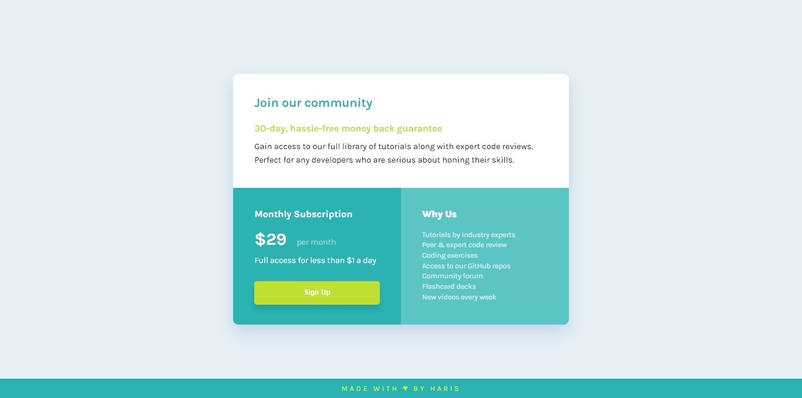

# Frontend Mentor - Single Price Grid Component

## Welcome! 👋

Thanks for checking out this front-end coding challenge.

This is a solution to the **Single Price Grid Component** challenge on [Frontend Mentor](https://www.frontendmentor.io). Frontend Mentor challenges help you improve your coding skills by building realistic projects.

## Table of Contents

- [Overview](#overview)
  - [The challenge](#the-challenge)
  - [Screenshot](#screenshot)
  - [Links](#links)
- [My process](#my-process)
  - [Built with](#built-with)
  - [What I learned](#what-i-learned)

## Overview

### The challenge

Your users should be able to:

- View the optimal layout for the component depending on their device's screen size

### Screenshot

#### Desktop

#### Mobile

### Links

- Solution URL: [GitHub Repository](https://github.com/harisdev-netizen/single-price-component)
- Live Site URL: [Live Preview](https://community-subscription.netlify.app/)

## My process

### Built with

- Semantic HTML5 markup
- CSS custom properties
- Flexbox
- Responsive design with media queries

### What I learned

**1. Google Fonts Integration:**
  - Integrated Google Fonts using the `@import` rule, giving the typography a clean, modern look.

**2. CSS Reset:**
  - Applied a reset to remove default `margins`, `padding`, and set `box-sizing: border-box` to ensure consistency across browsers.

**3. Flexbox Layout:**
  - Used Flexbox for easy alignment and responsiveness, centering content both vertically and horizontally.

**4. Responsive Design with Media Queries:**
  - Implemented media queries to ensure the layout adapts to various screen sizes, including mobile devices.

**5. Button Styling and Hover Effects:**
  - Styled the Sign-Up button with padding, bold text, and hover effects for a better user experience.

**Have fun building!** 🚀